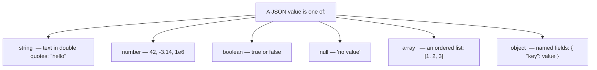
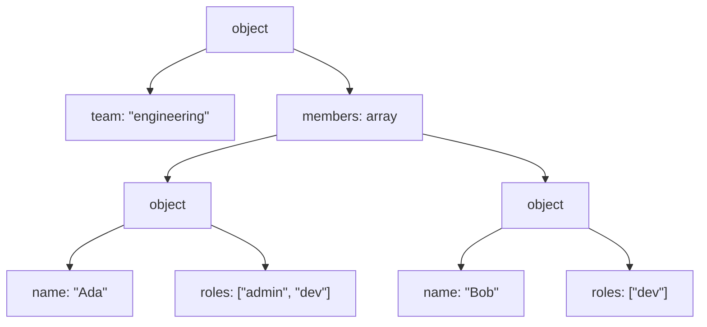

# Chapter 00 — What is JSON?

> New to JSON? Perfect — this chapter assumes you have never seen it before.
> If you already know JSON well, skim the "How pjson models JSON" section at the
> end and move on to [Chapter 01](01-getting-started.md).

## The problem JSON solves

Programs constantly need to **save data** and **send data** to other programs:
a game saving your progress, an app talking to a server, one tool handing
results to another. To do that, the data has to become plain **text** that
anyone can read and write.

**JSON** (JavaScript Object Notation) is one very popular way to write data as
text. Despite the name, it has nothing to do with JavaScript anymore — it is
used by virtually every programming language.

Here is a small piece of JSON describing a person:

```json
{
  "name": "Ada",
  "age": 36,
  "isEngineer": true,
  "languages": ["C++", "Ada"],
  "address": {
    "city": "London"
  }
}
```

Even without knowing the rules yet, you can probably read it. That readability
is the whole point.

## The building blocks

JSON is made of just a few kinds of values. That is what makes it simple.



Let's meet each one.

### 1. String — text

A string is text wrapped in **double quotes**:

```json
"Hello, World!"
```

Some characters are special and must be written with a backslash (this is
called *escaping*): `\"` for a quote, `\\` for a backslash, `\n` for a newline,
`\t` for a tab. So a string containing a quote looks like `"she said \"hi\""`.

### 2. Number

Numbers are written plainly, no quotes:

```json
42
-17
3.14
1e6
```

That last one, `1e6`, means 1 × 10⁶ = 1000000 — a compact way to write big or
tiny numbers.

### 3. Boolean — true or false

Exactly two values: `true` and `false`. Useful for yes/no facts like
`"isEngineer": true`.

### 4. null — "there is no value here"

`null` means "empty / nothing / unknown". It is different from the number `0`
or an empty string `""`.

### 5. Array — an ordered list

An array is a list of values in **square brackets**, separated by commas. Order
matters, and the values can be of different kinds:

```json
[1, 2, 3]
["red", "green", "blue"]
[1, "two", true, null]
```

### 6. Object — named fields

An object is a set of **key: value** pairs in **curly braces**. Each key is a
string. This is how you give data names:

```json
{
  "name": "Ada",
  "age": 36
}
```

## Nesting: the powerful part

Any value can contain other values. An object can hold arrays, arrays can hold
objects, objects can hold objects — as deep as you like. That is how JSON
describes complex, real-world data:

```json
{
  "team": "engineering",
  "members": [
    { "name": "Ada",  "roles": ["admin", "dev"] },
    { "name": "Bob",  "roles": ["dev"] }
  ]
}
```

Read it top-down: an object with a `team` string and a `members` array; each
member is an object with a `name` and a `roles` array of strings.



## A few rules to remember

- Object keys are **always strings in double quotes**.
- Commas **separate** items but must **not** trail the last one:
  `[1, 2, 3]` is valid, `[1, 2, 3,]` is not.
- The whole document is exactly **one** value (usually an object or array).

## How pjson models JSON

pjson mirrors this model with a single C++ class, `ByteDance::pjson`. One
`pjson` object holds exactly one JSON value, and you can ask what kind it is:

| JSON kind | pjson type tag | How it is stored |
|-----------|----------------|------------------|
| null      | `jsonNull`        | — |
| string    | `jsonString`      | `std::string` |
| number    | `jsonNumberInt` or `jsonNumberDouble` | `int64_t` (whole numbers) or `double` |
| boolean   | `jsonBoolean`     | `bool` |
| array     | `jsonArray`       | list of `pjson` |
| object    | `jsonObject`      | unique `string -> pjson` members |

Two pjson-specific details worth knowing early:

- **Numbers split into two types.** A whole number like `42` is kept as a 64-bit
  integer; anything with a fraction or exponent like `3.14` is kept as a
  `double`. Read either representation with the matching `tryGet()` overload.
- **Object member order is unspecified.** pjson stores members in a private hash
  table for fast lookup. `keys()`, callback traversal, and serialization expose
  its unspecified native order; JSON objects are unordered collections.

## What you learned

- JSON is a simple, text-based way to represent data.
- A JSON value is one of: string, number, boolean, null, array, or object.
- Values nest freely, which lets JSON describe complex data.
- pjson represents any JSON value with one class, `pjson`, storing whole numbers
  as `int64` and other numbers as `double`, with unspecified object-member order.

Next: [Chapter 01 — Getting started](01-getting-started.md), where you compile
and run your first pjson program.
