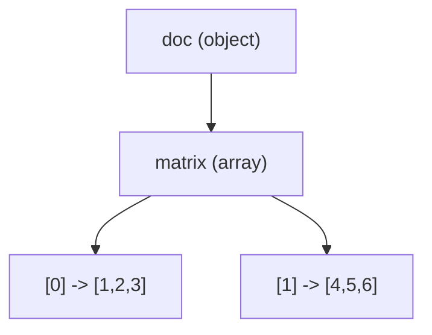

# Chapter 02 — Creating JSON

Now that you can compile a program, let's learn every way to **put data into**
a pjson value. Follow along with
[`examples/src/02_building_values.cpp`](../examples/src/02_building_values.cpp).

## The key idea: assignment builds the tree

A `pjson` starts as `null`. You shape it simply by assigning to it. pjson
figures out the type from what you assign.

```cpp
pjson v;                 // null
v = int64_t(42);         // now an integer
v = "hello";             // now a string
v = true;                // now a boolean
v = double(3.14);        // now a double
```

Assigning a new value **replaces** whatever was there — the type can change
freely.

## Objects: assign to a key

Indexing with a string key, `v["name"]`, makes `v` an **object** and gives you
the value stored under that key (creating it if needed):

```cpp
pjson person;
person["name"] = "Ada";       // person becomes an object
person["age"]  = int64_t(36);
person["isEngineer"] = true;
```

> This automatic creation is called **auto-vivification**: reading or writing
> `v["key"]` *creates* that key if it is missing. It is what makes building so
> concise. The flip side — that it also creates keys when you only meant to
> *read* — is covered in [Chapter 03](03-parsing-and-reading.md).

Nesting objects is just chained indexing:

```cpp
person["address"]["city"] = "London";
person["address"]["zip"]  = "N1";
```

The first `person["address"]` creates an empty object, and `["city"]` adds a
key inside it.

## Numbers

pjson keeps whole numbers as 64-bit integers and everything else as `double`:

```cpp
person["age"]   = int64_t(36);         // jsonNumberInt
person["score"] = double(4.5);         // jsonNumberDouble
person["big"]   = int64_t(9000000000); // jsonNumberInt
```

All standard non-character integer types and `float`, `double`, and `long double` are accepted
for convenient builder syntax. Values are stored as signed or unsigned 64-bit
integers, or as `double`; a `long double` is therefore narrowed explicitly.

## Strings

Assign a `const char*` or a `std::string`:

```cpp
person["name"] = "Ada";                 // const char*
std::string s = "Lovelace";
person["surname"] = s;                  // std::string
```

pjson automatically **escapes** special characters when serializing, so you can
store quotes, newlines, tabs, and Unicode freely — you never escape by hand.

## Arrays: three ways

### 1. From a `std::vector`

The most direct way to make an array:

```cpp
person["scores"] = std::vector<int64_t>({90, 82, 77});
```

Vectors of the supported non-character numeric types, `bool`, and `std::string`
are supported. Build arrays of other value types element by element.

### 2. By index

Assigning to a numeric index makes an array and places the element. If you skip
indices, the gaps are filled with `null`:

```cpp
person["mixed"][0] = int64_t(1);
person["mixed"][1] = "two";
person["mixed"][3] = true;   // index 2 is auto-filled with null
```

Arrays can hold **mixed** types — that is perfectly valid JSON.
One index access may create at most 1,000,000 children. An access that would
cross that growth limit throws `std::length_error` before changing the value.

### 3. By appending with `+=`

`+=` promotes the value to an array (if it isn't already) and appends:

```cpp
person["tags"] += "c++";
person["tags"] += "json";   // tags is now ["c++", "json"]
```

You can append a whole vector at once too:

```cpp
person["tags"] += std::vector<std::string>({"fast", "simple"});
```

## Deep nesting

Because every value can contain values, you build complex documents by
combining the above:

```cpp
pjson doc;
doc["matrix"][0] = std::vector<int64_t>({1, 2, 3});
doc["matrix"][1] = std::vector<int64_t>({4, 5, 6});
```



## Serializing the result

As you saw in Chapter 01, a default `SerializeOptions` gives compact JSON and
`SerializeOptions::prettyPrinted()` selects two-space pretty output. The fields
let you make each output choice explicit:

```cpp
pjson::SerializeOptions options = pjson::SerializeOptions::prettyPrinted();
options.indentWidth = 2;
options.indentCharacter = ' ';       // a space or tab
options.escapeNonAscii = false;      // keep UTF-8 instead of \u escapes
options.maxOutputBytes = size_t(64) * 1024 * 1024;

std::string text = person.toString(options);
```

A default-constructed `SerializeOptions` produces compact output. Its other
defaults are a two-space indent, raw non-ASCII UTF-8, and a
64 MiB output limit. Set `maxOutputBytes = 0` only when explicitly requesting
unlimited output. Only space and tab are valid indentation characters; another
value falls back to space. Stored
strings must contain valid UTF-8: `toString()` throws `std::invalid_argument`
for invalid bytes, while `write()` sets the destination stream's failure state.
Crossing the output limit or overflowing indentation arithmetic instead throws
`std::length_error` from `toString()` or sets `failbit` from `write()`. These
logical failures are detected before `write()` emits bytes. Double formatting
is locale-independent and uses pinned Ryu shortest-round-trip conversion;
integral-looking doubles keep a
decimal marker so reparsing preserves their storage kind.

Running the example produces (abridged):

```json
{
  "address": {
    "city": "London",
    "zip": "N1"
  },
  "mixed": [
    1,
    "two",
    null,
    true
  ],
  "scores": [
    90,
    82,
    77
  ],
  "tags": [
    "c++",
    "json",
    "fast",
    "simple"
  ]
}
```

Remember: object insertion and output order are unspecified, and the skipped
array index shows up as `null`.

## What you learned

- Assigning to a `pjson` sets its type; assigning again replaces it.
- `v["key"]` builds objects; `v[index]` and `v += x` build arrays.
- Missing keys/indices are created automatically (auto-vivification); array gaps
  fill with `null`.
- Whole numbers are stored as int64, other numbers as double; strings are
  auto-escaped on output.
- `SerializeOptions` controls pretty layout, indentation, non-ASCII escaping,
  non-finite values, and output limits.

Next: [Chapter 03 — Parsing & reading](03-parsing-and-reading.md), where you go
the other direction: text into data, and reading it back safely.
