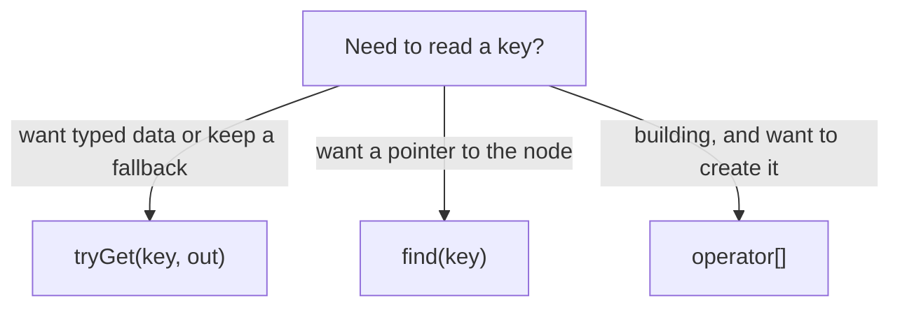

# Chapter 03 — Parsing & reading

So far we *built* JSON. Now we go the other way: take a JSON **string** and turn
it into a `pjson` you can read. Follow along with
[`examples/src/03_parsing_and_reading.cpp`](../examples/src/03_parsing_and_reading.cpp).

## Parsing with `parse()`

Include the parser separately from the DOM, then construct a parser and call
`parse()`. The dependency is one-way: `pJsonParser` uses `pjson`; `pjson` does
not depend on the parser.

```cpp
#include "pjson.h"
#include "pjson_parser.h"

pJsonParser parser;
pJsonParser::Error err;
pjson doc = parser.parse(R"({ "name": "Ada", "age": 36 })", err);
if (!err.ok) {
    // parsing failed — the text was not valid JSON
}
```

Two things to understand:

- **`parse()` returns a `pjson` by value** that owns its subtree and frees it
  when it goes out of scope. You never call `delete`, and there is no smart
  pointer in the API. Use `doc.method()` directly. To move the result into
  another document, `dest["k"] = std::move(doc);`.
- On a JSON failure the terse `parse(text)` returns a JSON `null` value; pass a
  `pJsonParser::Error` (as above) to tell failure apart from a successfully parsed
  literal `null`. Malformed input does not escape as an exception. Stream
  objects configured to throw can still propagate I/O exceptions from
  `parseStream()`. (Chapter 05 shows how to find out why JSON parsing failed.)

> `R"(...)"` is a C++ *raw string literal*. Inside it, quotes and backslashes
> are literal, so you can paste JSON without escaping every `"`. Very handy.

## Reading scalar values by exact type

For data you did not build yourself, prefer `tryGet()`. It returns `true` only
when the value has the requested type and leaves the output unchanged on
failure:

```cpp
const pjson& j = doc;

int64_t age = 0;
if (!j.tryGet("age", age)) {
    // missing, or present with the wrong type
}

std::string name;
if (j.tryGet("name", name)) {
    std::cout << name;
}
```

There are node-level, keyed, and indexed overloads for `int64_t`, `double`,
`bool`, `std::string`, and `pjson::StringView`. An integer may widen to a
`double`; other conversions are deliberately rejected.

### Copy-free strings with `StringView`

Use `StringView` to inspect a stored string without allocating a copy:

```cpp
pjson::StringView name;
if (j.tryGet("name", name)) {
    std::cout.write(name.data(), static_cast<std::streamsize>(name.size()));
}
```

The view borrows bytes owned by the JSON node. Assignment, reset, swap, move,
destruction, erasing the node, or replacing/resetting an ancestor invalidates
it. Strings can contain embedded NUL bytes, so use `size()` rather than
`strlen()`. Copy into a `std::string` when the text must outlive the unchanged
node.

## The sharp edge: `[]` creates missing keys

Recall auto-vivification from Chapter 02. It applies when **reading** too:
`j["typo"]` will *create* an empty `"typo"` key if it doesn't exist. That is
rarely what you want when reading, so pjson gives you non-mutating tools.

### `hasKey` — does the key exist?

```cpp
if (j.hasKey("email")) { /* ... */ }
```

### `find` — look up without creating

`find` returns a pointer to the value, or `nullptr` if absent. It never
modifies the document:

```cpp
if (const pjson* p = j.find("email")) {
    std::string email;
    if (p->tryGet(email)) { /* use email */ }
}
```

### `tryGet` — read only when present and well typed

```cpp
int64_t age = 0;
if (j.tryGet("age", age)) {
    // age was present as an integer; now holds 36
}
```

### Read with a fallback

The most concise "read or default" form:

```cpp
std::string email = "(none)";
j.tryGet("email", email); // a failed read leaves the fallback unchanged
int64_t count = int64_t(0);
j.tryGet("count", count);
```



**Rule of thumb:** use `[]` when *building*, and `find`/`tryGet` when *reading*.

## Reading arrays

Given `"scores": [90, 82, 77]`, there are a few ways to read it.

### Check and find array indexes

`hasIndex()` and `find(index)` inspect an array without growing it. Negative
indexes count from the end, so `-1` means the last element:

```cpp
if (const pjson* scores = j.find("scores")) {
    int64_t last = 0;
    if (scores->hasIndex(-1) && scores->tryGet(-1, last)) {
        std::cout << "last score = " << last << "\n";
    }

    if (const pjson* first = scores->find(0)) {
        // first points at the existing element; no element was created
    }
}
```

Out-of-range indexes and non-array values return `false`/`nullptr`. Unlike
`operator[]`, these operations never auto-vivify or resize.

### Iterate an array

Use `size()` plus `find(index)` to visit borrowed child nodes without exposing
or mutating internal storage:

```cpp
if (const pjson* node = j.find("scores")) {
    for (size_t i = 0; node->isArray() && i < node->size(); ++i) {
        const pjson* score = node->findIndex(i);
        int64_t value = 0;
        if (score && score->tryGet(value))
            std::cout << value << " ";
    }
}
```

### Copy into a typed vector

```cpp
std::vector<int64_t> vals;
if (const pjson* scores = j.find("scores")) {
    for (size_t i = 0; scores->isArray() && i < scores->size(); ++i) {
        int64_t value = 0;
        if (!scores->tryGet(static_cast<int>(i), value)) {
            vals.clear();
            break;
        }
        vals.push_back(value);
    }
}
```

Here a mixed or mistyped element rejects the whole copy instead of silently
coercing it.

### Array of objects

Combine iteration with per-element lookup:

```cpp
if (const pjson* friends = j.find("friends")) {
    if (friends->isArray()) {
        for (size_t i = 0; i < friends->size(); ++i) {
            const pjson* friend_ = friends->findIndex(i);
            pjson::StringView name;
            if (friend_ && friend_->tryGet("name", name))
                std::cout.write(name.data(), static_cast<std::streamsize>(name.size()));
        }
    }
}
```

## Reading a nested path with JSON Pointer

`findPointer()` implements non-mutating RFC 6901 JSON Pointer lookup. The empty
pointer addresses the current value; every non-empty pointer starts with `/`:

```cpp
pjson::PointerError error;
if (const pjson* city = j.findPointer("/address/city", error)) {
    std::string text;
    if (city->tryGet(text))
        std::cout << text;
} else {
    std::cerr << "pointer token " << error.tokenIndex
              << ": " << error.message << "\n";
}
```

Pointer tokens encode `~` as `~0` and `/` as `~1`. When a key is dynamic, build
the token with `pjson::escapePointerToken(key)`. Array tokens are canonical
non-negative indexes; negative indexes and the JSON Patch append token `-` are
not valid lookups. The overload without `PointerError` simply returns `nullptr`
for any failure.

## Iterating an object

To iterate an object's keys, use `keys()` (returned sorted):

```cpp
for (const std::string& key : j.keys()) {
    const pjson* value = j.find(key);
    if (value) {
        pjson::SerializeOptions compact;
        compact.maxOutputBytes = size_t(64) * 1024 * 1024;
        std::cout << key << " => " << value->toString(compact) << "\n";
    }
}
```

## What you learned

- `parse()` returns a `pjson` value and reports failures through a `pJsonParser::Error`
  out-param (the terse overload yields a JSON `null` on failure).
- `tryGet()` provides exact-type node/key/index reads and leaves outputs unchanged
  on failure; `StringView` offers a mutation-sensitive, copy-free string view.
- `find`, `findPointer`, `hasKey`, and `hasIndex` inspect without creating; use
  `[]` when building. Indexed lookups support negative indexes.
- Read arrays via `size()` plus checked indexes, and iterate objects via
  `keys()` plus `find()`.

Next: [Chapter 04 — Editing](04-editing.md), where you modify a document you
parsed.
