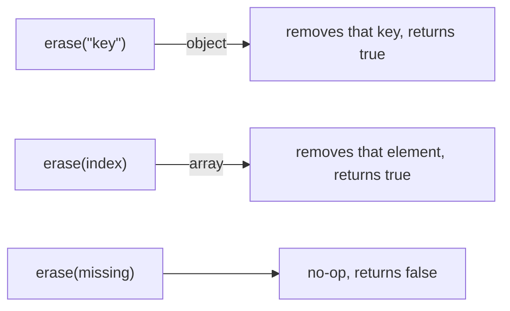

# Chapter 04 — Editing

A parsed document is fully mutable. Editing uses the same building blocks from
Chapter 02, because `operator[]` returns a **reference** you can assign through.
Follow along with [`examples/src/04_editing.cpp`](../examples/src/04_editing.cpp).

## Changing a value in place

Index to the value and assign a new one:

```cpp
pjson::ParseError err;
pjson j = pjson::parse(R"({ "user": { "name": "Ada" }, "count": 2 })", err);

j["user"]["name"] = "Ada Lovelace";   // change a string
j["count"] = int64_t(3);               // change a number
```

You can even change a value's **type** — arrays and objects are heterogeneous
and dynamic:

```cpp
j["count"] = "two";   // was a number, now a string — perfectly fine
```

## Adding new data

Because missing keys and indices are created on demand (auto-vivification),
adding is just assignment:

```cpp
j["user"]["email"] = "ada@example.com";  // new nested key
j["user"]["roles"] += "owner";           // append to (or create) an array
```

## Removing data with `erase`

`erase` deletes a key from an object or an element from an array, freeing it.
It returns `true` if something was removed.

```cpp
j.erase("deprecated");            // remove object key "deprecated"
j["user"]["roles"].erase(size_t(0)); // remove array element at index 0
```

Note the `size_t(0)`: the array overload takes an index, and the cast makes it
unambiguous versus the string-key overload.



## Emptying and rebuilding

- `clear()` empties an array or object **but keeps its type**, so you can refill
  it. On a scalar it resets to `null`.
- `reset()` returns any value to `null`.
- `resetTo(type)` makes the node an empty value of a given type (e.g. an empty
  array or object), replacing whatever was there.
- `resetIfNeeded(type)` is the idempotent form: it only rebuilds the node when
  it is not already that type, so an existing array/object keeps its contents.

```cpp
j["user"]["roles"].clear();   // now []
j["user"]["roles"] += "guest";

j["tags"].resetTo(pjson::jsonArray);      // always starts empty
j["tags"].resetIfNeeded(pjson::jsonArray); // keeps existing tags if already an array
```

## Swapping two values

`swap(other)` exchanges two compatible nodes in O(1) without copying.
`canSwap()` lets you check that precondition. A swap that cannot be performed is
a safe no-op, and `swap()` itself is `noexcept`.

```cpp
pjson& a = j["a"];
pjson& b = j["b"];
if (a.canSwap(b))
    a.swap(b);   // exchange the two sub-trees in place
```

Sibling nodes in the same document are compatible. Check `canSwap()` when the
values come from different sources.

## Editing a path atomically

For a sequence of path-based edits, `applyPatch()` implements JSON Patch (RFC
6902). The patch is an array of `add`, `remove`, `replace`, `move`, `copy`, and
`test` operations:

```cpp
pjson patch = pjson::parse(R"([
    { "op": "replace", "path": "/user/name", "value": "Ada Byron" },
    { "op": "add", "path": "/user/roles/-", "value": "reviewer" }
])",
                           err);

pjson::PatchError error;
pjson::PatchOptions limits;
if (!j.applyPatch(patch, error, limits)) {
    std::cerr << "patch operation " << error.opIndex
              << ": " << error.message << "\n";
}
```

Patch paths use JSON Pointer syntax. An empty path addresses the whole document;
in particular, removing the root succeeds and leaves the target as JSON null:

```cpp
pjson removeRoot = pjson::parse(R"([{"op":"remove","path":""}])", err);
if (err.ok && j.applyPatch(removeRoot, error, limits)) {
    // j.isNull() is now true
}
```

`-` is allowed only as the final `add` token to append to an array. If any other
operation fails, the entire call returns `false` and `j` remains unchanged.
`PatchError` identifies the failing operation, path or `from` token, and reason.

For object-shaped updates, `applyMergePatch()` implements JSON Merge Patch
(RFC 7396):

```cpp
pjson merge = pjson::parse(R"({
    "user": { "email": "ada@example.com", "nickname": null }
})",
                           err);

if (!j.applyMergePatch(merge, error, limits)) {
    std::cerr << error.message << "\n";
}
```

An object patch merges recursively, a `null` member removes that object key, and
a non-object patch replaces the complete target. Merge Patch is atomic too.

The trailing `PatchOptions` argument bounds transactional amplification for
both patch formats. Defaults are 10,000 operations, 1,000,000 cloned nodes,
64 MiB of cloned node/string/key bytes, and 1,000,000 work units. For RFC 6902,
the operation limit counts array entries; for Merge Patch, it counts processed
members:

```cpp
pjson::PatchOptions limits;
limits.maxOperations = 10000;
limits.maxClonedNodes = 1000000;
limits.maxClonedBytes = size_t(64) * 1024 * 1024;
limits.maxWork = 1000000;
```

A zero field retains its built-in hard ceiling; it never disables a patch
limit. Exceeding one reports `PatchError::ResourceLimit`, returns `false`, and
leaves the target unchanged.

Removing the document root is valid and leaves JSON null. Moving the root to a
descendant would move it beneath itself, so that case fails with
`PatchError::MoveRootNotAllowed`.

## Useful queries while editing

- `size()` — number of elements in an array/object (0 for scalars).
- `empty()` — `size() == 0`.
- `isArray()`, `isObject()`, `isString()`, ... — check the current type before
  acting.

```cpp
if (const pjson* user = j.find("user")) {
    const pjson* roles = user->find("roles");
    if (roles && roles->isArray() && !roles->empty()) {
        // safe to iterate
    }
}
```

## A complete edit

Running the example transforms the input into:

```json
{
  "count": "two",
  "user": {
    "email": "ada@example.com",
    "name": "Ada Lovelace",
    "roles": [
      "dev",
      "owner",
      "reviewer"
    ]
  }
}
```

Here `admin` was removed, `owner` and `reviewer` appended, `email` added, `name`
changed, and `count` turned into a string — all on a parsed document, then
re-serialized.

## A safety note on aliasing

pjson uses copy-and-swap for assignment, so even self-referential edits are
safe:

```cpp
if (const pjson* user = j.find("user"))
    j = *user; // replacing a root from its own child is safe
```

## What you learned

- `operator[]` returns a mutable reference, so editing is just assignment.
- Add by assigning to new keys/indices; append with `+=`.
- `erase(key)` / `erase(index)` remove and free; `clear()` empties keeping the
  type; `reset()` returns to `null`; `resetTo(type)`/`resetIfNeeded(type)` rebuild
  a node as an empty value of a given type; compatible nodes can be swapped.
- `applyPatch()` and `applyMergePatch()` apply standard path/object edits
  atomically and can report a structured `PatchError`.
- `size()`, `empty()`, and the `isX()` predicates help you edit safely.

Next: [Chapter 05 — Parsing & errors](05-parsing-and-errors.md).
