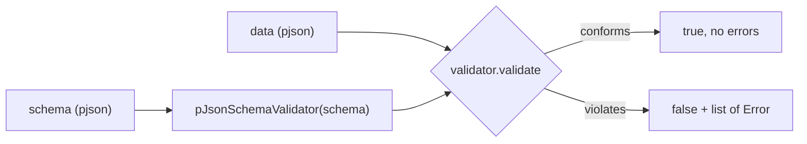

# Chapter 06 — Schema validation

Parsing tells you the input is *valid JSON*. It does **not** tell you the data
has the shape your program needs — the right keys, the right types, sensible
ranges. That is what **schema validation** is for. Follow along with
[`examples/src/06_schema_validation.cpp`](../examples/src/06_schema_validation.cpp).

## What is a schema?

A **schema** is a description of what valid data looks like: "must be an object,
must have a `name` string and a non-negative `age` integer", and so on. In
pjson, a schema is *itself a JSON value* (a `pjson`), written with pjson's
documented subset of the widely-used
[JSON Schema](https://json-schema.org) vocabulary. It is not a claim of complete
conformance to a JSON Schema draft. Schemas load, build, and round-trip exactly
like any other pjson value.

Validation itself lives in a separate helper class,
`ByteDance::pJsonSchemaValidator`, declared in `<pjson_schema.h>`. It is a pure
consumer of pjson's public API: the core `pjson` class carries no schema or
regex state, and the implementation is isolated in focused private translation units. You
compile a schema into a validator once and reuse it to check many instances.



## A first schema

```cpp
#include "pjson_schema.h"

pjson::ParseError err;
pjson schema = pjson::parse(R"({
    "type": "object",
    "required": ["name", "age"],
    "properties": {
        "name": { "type": "string", "minLength": 1 },
        "age":  { "type": "integer", "minimum": 0, "maximum": 150 }
    }
})",
                            err);
```

Read it in English: *the value must be an object; it must have `name` and `age`;
`name` must be a non-empty string; `age` must be an integer from 0 to 150.*

## Validating

Build a validator from the schema, then validate instances against it:

```cpp
pJsonSchemaValidator validator(schema);
if (!validator.isSchemaValid()) {
    for (const pJsonSchemaValidator::Error& e : validator.schemaErrors())
        std::cerr << "invalid schema at " << e.schemaLocation << ": " << e.message << "\n";
}

pjson data = pjson::parse(R"({ "name": "Ada", "age": 36 })", err);

// Simple yes/no:
bool ok = validator.validate(data);
```

The validator deep-copies the schema on construction, so the original `schema`
value may change or be destroyed afterward. A single validator can check any
number of instances and is cheap to reuse.

## Dialect and vocabulary contract

pjson retains one named dialect for backward-compatible subset behavior and an
explicit opt-in Draft 2020-12 mode:

```cpp
const char* dialect = pJsonSchemaValidator::documentedSubsetDialectUri();
const char* vocabulary = pJsonSchemaValidator::documentedSubsetVocabularyUri();
pJsonSchemaValidator::Options draft2020 =
    pJsonSchemaValidator::Options::draft2020();
```

Default options require the subset dialect. `Options::draft2020()` accepts the
official Draft 2020-12 URI, validates schemas against bundled standard
meta-schemas, enables modern `$ref` sibling behavior, and applies vocabularies
per schema resource. Custom meta-schema URIs require an application resolver and
are accepted only when `resolveCustomDialects` is enabled (as in the preset).

Under this subset dialect, `$vocabulary` is an object mapping vocabulary URIs
to booleans. The pjson subset vocabulary may be required (`true`); unknown
optional vocabularies (`false`) are accepted as annotations; unknown required
vocabularies fail schema compilation. Malformed `$schema`/`$vocabulary` shapes
also fail compilation. `schemaErrors()` reports these failures with
`Error::SchemaCompilation`; instance failures use `Error::InstanceValidation`.
All local and external references are indexed and resolved while the validator
is constructed. The resolver context is not retained, and repeated or concurrent
`validate()` calls perform no resolver I/O or cache mutation.

To learn *what* failed, pass a vector — the validator normally collects every
applicable failure instead of stopping at the first (a resource-budget failure
stops the traversal):

```cpp
std::vector<pJsonSchemaValidator::Error> errors;
if (!validator.validate(data, errors)) {
    for (const pJsonSchemaValidator::Error& e : errors) {
        std::cout << (e.instanceLocation.empty() ? "(root)" : e.instanceLocation)
                  << ": " << e.message << "\n";
    }
}
```

The overload appends to the vector, so call `errors.clear()` before reusing it
when old results are not wanted. Normally all applicable failures are
collected; reaching a validation-depth or reference-resolution budget stops
that traversal safely.

Each `pJsonSchemaValidator::Error` has a stable `code`, an `instanceLocation`
(a **JSON Pointer** like `/age` or `/friends/2/name`, empty for the document
root), a `schemaLocation`, a triggering `keyword`, a `message`, and optional
nested `causes`. `category` distinguishes instance failures from
schema-compilation failures. Set `Options::stopAfterFirstError` to stop after
one public failure or `Options::collectNestedCauses` to retain bounded branch
failures under `anyOf` and zero-match `oneOf` errors. From the example, an
all-bad document reports:

```
/age: value 200.0 is above maximum 150.0
/email: string does not match pattern /@/
/name: string length 0 is below minLength 1
/roles/0: value is not in the allowed enum
/extra: additional property "extra" is not allowed
```

Notice how the path points precisely at each offending node — including deep
into arrays (`/roles/0`).

## Supported keywords

pjson implements the documented keyword subset below. By default, unknown and
unsupported keywords are **ignored, not enforced**. This permits annotations and
future vocabulary to pass through, but it also means a misspelled or unsupported
constraint can silently weaken validation. Treat this table as an allowlist and
test both accepted and rejected instances for every application schema, or use
`pJsonSchemaValidator::Options::strict()` to reject unsupported standard keywords
outright.

| Applies to | Keywords and forms |
|------------|--------------------|
| any value  | `type`, `enum`, `const`, `$ref`, `$dynamicRef`, `$id`, `$anchor`, `$dynamicAnchor` |
| conditional| `if`, `then`, `else` |
| objects    | `properties`, `patternProperties`, `propertyNames`, `required`, `dependentRequired`, `dependencies`, `dependentSchemas`, `additionalProperties`, `unevaluatedProperties`, `minProperties`, `maxProperties` |
| arrays     | single-schema `items`, tuple `prefixItems` (and legacy tuple-array `items`), `contains`, `minContains`, `maxContains`, `unevaluatedItems`, `minItems`, `maxItems`, `uniqueItems` |
| numbers    | `minimum`, `maximum`, numeric `exclusiveMinimum`, numeric `exclusiveMaximum`, `multipleOf` |
| strings    | `minLength`, `maxLength`, `pattern` (ECMAScript regex), `format` |
| combinators| `allOf`, `anyOf`, `oneOf`, `not` |

A few notes:

- `type: "integer"` matches whole numbers (including `2.0`); `type: "number"`
  matches any int or double. `type` may also be an **array** of allowed names,
  e.g. `"type": ["string", "null"]`.
- `enum` and `const` use deep equality, so they work for arrays and objects too.
- `$ref` resolves local JSON Pointers and anchors against `$id` resource bases.
  External document URIs are resolved only through an application-supplied
  function pointer (`Options::resolver`); pjson never performs network I/O.
  Resolution is bounded by reference, document, byte, work, and depth budgets.
- `$dynamicRef` and `$dynamicAnchor` follow dynamic scope across local and
  explicitly resolved resources. `Options::modernSubset()` applies `$ref`
  siblings as modern drafts require; the default preserves the former Draft 7
  replacement behavior for compatibility.
- `unevaluatedProperties` and `unevaluatedItems` consume successful evaluation
  annotations propagated through references, conditionals, combinators,
  `contains`, and the regular object/array applicators.

An application that allows references to other schema documents supplies them
explicitly. The callback receives an absolute document URI (without a fragment),
fills the output value, and returns success; it must not fetch anything the
application's policy does not authorize:

```cpp
bool resolveSchema(const std::string& uri, pjson& output, void* context) {
    const SchemaStore& store = *static_cast<const SchemaStore*>(context);
    return store.find(uri, output); // copy the matching schema into output
}

pJsonSchemaValidator::Options options =
    pJsonSchemaValidator::Options::modernSubset();
options.retrievalUri = "https://example.test/schemas/root.json";
options.resolver = resolveSchema;
options.resolverContext = &store;
pJsonSchemaValidator validator(schema, options);
```

The callback runs only during construction. Returned documents are copied into
validator-owned storage, and the callback/context pointers are then cleared.
- `patternProperties` applies schemas to matching keys, `propertyNames` checks
  each key, and `dependentRequired`/`dependencies` express rules triggered by
  the presence of another property.
- Known string formats are `date`, `time`, `date-time`, `ipv4`, `ipv6`, `uuid`,
  and `regex`. They are checked by the normal/default options;
  `Options::modernSubset()` follows Draft 2020-12 and treats them as annotations
  unless `validateFormats` is explicitly re-enabled. Unknown names are ignored.
- A **boolean schema** is allowed: `true` accepts everything, `false` rejects
  everything (handy as a sub-schema, e.g. `"additionalProperties": false`).
- `pattern` uses a private Unicode-aware ECMAScript engine with search semantics,
  including Unicode property escapes and non-BMP code points. Default options
  bound pattern and subject byte sizes and reject expressions disallowed by the
  regex safety policy. The engine also has a finite internal work ceiling.
  Applications that fully trust both schemas and instances may opt out of the
  conservative syntax policy with
  `pJsonSchemaValidator::Options::trustedRegex()`.

The supported vocabulary is deliberately a subset. Tuple-form `items` validates
the corresponding array positions, but elements beyond the tuple remain
unconstrained because `additionalItems` is not implemented. `minLength` and
`maxLength` count Unicode code points, not UTF-8 bytes. Unknown keywords and
malformed keyword forms are ignored in the default permissive mode. Strict mode
rejects malformed values for every supported keyword before instance validation.
Draft 2020 mode additionally validates against the selected standard or resolved
custom meta-schema.

## Validation options and resource budgets

`pJsonSchemaValidator::Options` controls regex policy, traversal budgets, and
format checking. Pass it when constructing the validator:

```cpp
pJsonSchemaValidator::Options options;
options.maxRegexPatternBytes = 256;
options.maxRegexSubjectBytes = 4096;
options.allowUnsafeRegex = false;
options.maxValidationDepth = 64;
options.maxRefResolutions = 1024;
options.maxValidationWork = 1000000;
options.maxErrors = 100;
options.stopAfterFirstError = false;
options.collectNestedCauses = false;
options.validateFormats = true;
options.strictSubset = false; // set true to fail closed on unsupported keywords
options.refSiblings = false;  // modernSubset() sets true and validateFormats false
options.retrievalUri.clear(); // set when a root schema with relative refs was retrieved by URI
options.defaultDialectUri = pJsonSchemaValidator::documentedSubsetDialectUri();
options.resolver = nullptr;   // no implicit external I/O
options.resolverContext = nullptr;
options.maxResolvedDocuments = 32;
options.maxResolvedBytes = size_t(16) * 1024 * 1024;

pJsonSchemaValidator validator(schema, options);
std::vector<pJsonSchemaValidator::Error> errors;
bool ok = validator.validate(data, errors);
```

These are the defaults. A zero regex byte limit disables that individual regex
limit and should be reserved for trusted input. Zero for the validation-depth,
reference-resolution, work, or error-count budget retains that budget's
documented hard ceiling rather than disabling it.
Validation depth has an absolute hard ceiling of 64; larger configured values
are clamped to 64 to bound native-stack use during recursive keyword evaluation.
`pJsonSchemaValidator::Options::trustedRegex()` disables both regex byte limits
and permits unsafe regular expressions while retaining all other defaults. Set
`validateFormats = false` when known formats should act only as annotations.
Set `strictSubset = true` (or use `pJsonSchemaValidator::Options::strict()`) to
**fail closed**: a schema that uses a standard validation/applicator keyword
pjson does not implement (for example `contentSchema` or `$recursiveRef`)
or a malformed value for a supported keyword then makes schema compilation
fail instead of silently ignoring the constraint. Unknown non-standard
extension keywords are still allowed as annotations even in strict mode.

## Combinators and conditionals (composing schemas)

The logical keywords let you build up complex rules:

- `allOf`: must satisfy **every** sub-schema.
- `anyOf`: must satisfy **at least one**.
- `oneOf`: must satisfy **exactly one**.
- `not`: must **not** satisfy the sub-schema.
- `if` / `then` / `else`: when the value matches `if`, it must also satisfy
  `then`; otherwise it must satisfy `else`.

```json
{ "anyOf": [ { "type": "string" }, { "type": "integer" } ] }
```

accepts a value that is either a string or an integer.

## Building schemas programmatically

Since a schema is just a `pjson`, you can build it with the API instead of
parsing text:

```cpp
pjson schema;
schema["type"] = "object";
schema["required"][0] = "name";
schema["required"][1] = "age";
schema["properties"]["name"]["type"] = "string";
schema["properties"]["age"]["type"]  = "integer";
schema["properties"]["age"]["minimum"] = int64_t(0);
```

## What you learned

- A schema is a `pjson` describing valid data with pjson's documented JSON
  Schema keyword subset, not a complete draft implementation.
- Validation lives in the standalone `pJsonSchemaValidator` (in
  `<pjson_schema.h>`), a pure consumer of pjson's public API. Compile a schema
  once, then reuse the validator for many instances.
- `validator.validate(data)` returns yes/no; `validator.validate(data, errors)`
  collects **all** failures, each with a JSON-Pointer `path` and a `message`.
- The subset includes URI/anchor/dynamic references, `unevaluated*`, object and
  array constraints, known string formats, and logical combinators. External
  resources are available only through an explicit resolver callback. Unknown
  keywords are ignored and therefore enforce no constraint.
- `pJsonSchemaValidator::Options` bounds regex, validation depth, reference
  resolution, total validation work, and collected errors, and can disable
  known-format checks.

Next: [Chapter 07 — Capstone: address book](07-capstone-address-book.md), where
everything comes together in one small application.
