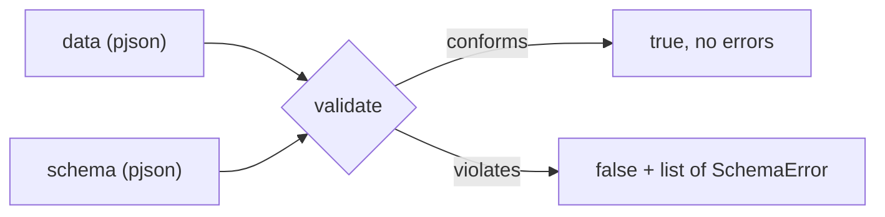

# Chapter 06 — Schema validation

Parsing tells you the input is *valid JSON*. It does **not** tell you the data
has the shape your program needs — the right keys, the right types, sensible
ranges. That is what **schema validation** is for. Follow along with
[`examples/src/06_schema_validation.cpp`](../examples/src/06_schema_validation.cpp).

## What is a schema?

A **schema** is a description of what valid data looks like: "must be an object,
must have a `name` string and a non-negative `age` integer", and so on. In
pjson, a schema is *itself a JSON value* (a `pjson`), written with pjson's
documented subset of the widely-used
[JSON Schema](https://json-schema.org) vocabulary. It is not a claim of complete
conformance to a JSON Schema draft. Schemas load, build, and round-trip exactly
like any other pjson value.



## A first schema

```cpp
auto schema = pjson::parse(R"({
    "type": "object",
    "required": ["name", "age"],
    "properties": {
        "name": { "type": "string", "minLength": 1 },
        "age":  { "type": "integer", "minimum": 0, "maximum": 150 }
    }
})");
```

Read it in English: *the value must be an object; it must have `name` and `age`;
`name` must be a non-empty string; `age` must be an integer from 0 to 150.*

## Validating

```cpp
auto data = pjson::parse(R"({ "name": "Ada", "age": 36 })");

// Simple yes/no:
bool ok = data->validate(*schema);
```

To learn *what* failed, pass a vector — pjson normally collects every applicable
failure instead of stopping at the first (a resource-budget failure stops the
traversal):

```cpp
std::vector<pjson::SchemaError> errors;
if (!data->validate(*schema, errors)) {
    for (const pjson::SchemaError& e : errors) {
        std::cout << (e.path.empty() ? "(root)" : e.path)
                  << ": " << e.message << "\n";
    }
}
```

The overload appends to the vector, so call `errors.clear()` before reusing it
when old results are not wanted. Normally all applicable failures are
collected; reaching a validation-depth or reference-resolution budget stops
that traversal safely.

Each `SchemaError` has a `path` (a **JSON Pointer** like `/age` or
`/friends/2/name`, empty for the document root) and a `message`. From the
example, an all-bad document reports:

```
/age: value 200.0 is above maximum 150.0
/email: string does not match pattern /@/
/name: string length 0 is below minLength 1
/roles/0: value is not in the allowed enum
/extra: additional property "extra" is not allowed
```

Notice how the path points precisely at each offending node — including deep
into arrays (`/roles/0`).

## Supported keywords

pjson implements the documented keyword subset below. Unknown and unsupported
keywords are **ignored, not enforced**. This permits annotations and future
vocabulary to pass through, but it also means a misspelled or unsupported
constraint can silently weaken validation. Treat this table as an allowlist and
test both accepted and rejected instances for every application schema.

| Applies to | Keywords and forms |
|------------|--------------------|
| any value  | `type`, `enum`, `const`, local-fragment `$ref` |
| objects    | `properties`, `patternProperties`, `propertyNames`, `required`, `dependentRequired`, `dependencies`, `additionalProperties` (boolean or schema), `minProperties`, `maxProperties` |
| arrays     | single-schema or tuple-array `items`, plus `minItems`, `maxItems`, `uniqueItems` |
| numbers    | `minimum`, `maximum`, numeric `exclusiveMinimum`, numeric `exclusiveMaximum`, `multipleOf` |
| strings    | `minLength`, `maxLength`, `pattern` (ECMAScript regex), `format` |
| combinators| `allOf`, `anyOf`, `oneOf`, `not` |

A few notes:

- `type: "integer"` matches whole numbers (including `2.0`); `type: "number"`
  matches any int or double. `type` may also be an **array** of allowed names,
  e.g. `"type": ["string", "null"]`.
- `enum` and `const` use deep equality, so they work for arrays and objects too.
- `$ref` resolves only a local URI fragment containing a JSON Pointer, such as
  `#/$defs/address`; both `$defs` and `definitions` can hold referenced schemas.
  Remote references are rejected, and siblings of `$ref` are ignored.
- `patternProperties` applies schemas to matching keys, `propertyNames` checks
  each key, and `dependentRequired`/`dependencies` express rules triggered by
  the presence of another property.
- Known string formats are `date`, `time`, `date-time`, `ipv4`, `ipv6`, and
  `uuid`. They are checked by default; unknown format names are ignored.
- A **boolean schema** is allowed: `true` accepts everything, `false` rejects
  everything (handy as a sub-schema, e.g. `"additionalProperties": false`).
- `pattern` uses `std::regex` ECMAScript syntax with search semantics. Default
  `SchemaOptions` bound pattern and subject byte sizes and reject expressions
  disallowed by the regex safety policy. Applications that fully trust both
  schemas and instances may opt out with
  `pjson::SchemaOptions::trustedRegex()`.

The supported vocabulary is deliberately a subset. Tuple-form `items` validates
the corresponding array positions, but elements beyond the tuple remain
unconstrained because `additionalItems` is not implemented. `minLength` and
`maxLength` count Unicode code points, not UTF-8 bytes. Unknown keywords and
many malformed keyword forms are ignored, and pjson does not validate schemas
against a meta-schema.

## Validation options and resource budgets

`SchemaOptions` controls regex policy, traversal budgets, and format checking:

```cpp
pjson::SchemaOptions options;
options.maxRegexPatternBytes = 256;
options.maxRegexSubjectBytes = 4096;
options.allowUnsafeRegex = false;
options.maxValidationDepth = 64;
options.maxRefResolutions = 1024;
options.maxValidationWork = 1000000;
options.maxErrors = 100;
options.validateFormats = true;

std::vector<pjson::SchemaError> errors;
bool ok = data->validate(*schema, errors, options);
```

These are the defaults. A zero regex byte limit disables that individual regex
limit and should be reserved for trusted input. Zero for the validation-depth,
reference-resolution, work, or error-count budget retains that budget's
documented hard ceiling rather than disabling it.
Validation depth has an absolute hard ceiling of 64; larger configured values
are clamped to 64 to bound native-stack use during recursive keyword evaluation.
`SchemaOptions::trustedRegex()` disables both regex byte limits and permits
unsafe regular expressions while retaining all other defaults. Set
`validateFormats = false` when known formats should act only as annotations.

## Combinators (composing schemas)

The logical keywords let you build up complex rules:

- `allOf`: must satisfy **every** sub-schema.
- `anyOf`: must satisfy **at least one**.
- `oneOf`: must satisfy **exactly one**.
- `not`: must **not** satisfy the sub-schema.

```json
{ "anyOf": [ { "type": "string" }, { "type": "integer" } ] }
```

accepts a value that is either a string or an integer.

## Building schemas programmatically

Since a schema is just a `pjson`, you can build it with the API instead of
parsing text:

```cpp
pjson schema;
schema["type"] = "object";
schema["required"][0] = "name";
schema["required"][1] = "age";
schema["properties"]["name"]["type"] = "string";
schema["properties"]["age"]["type"]  = "integer";
schema["properties"]["age"]["minimum"] = int64_t(0);
```

## What you learned

- A schema is a `pjson` describing valid data with pjson's documented JSON
  Schema keyword subset, not a complete draft implementation.
- `validate(schema)` returns yes/no; `validate(schema, errors)` collects **all**
  failures, each with a JSON-Pointer `path` and a `message`.
- The subset includes local `$ref`, object constraints, known string formats,
  and logical combinators. Unknown keywords are ignored and therefore enforce
  no constraint.
- `SchemaOptions` bounds regex, validation depth, reference resolution, total
  validation work, and collected errors, and can disable known-format checks.

Next: [Chapter 07 — Capstone: address book](07-capstone-address-book.md), where
everything comes together in one small application.
