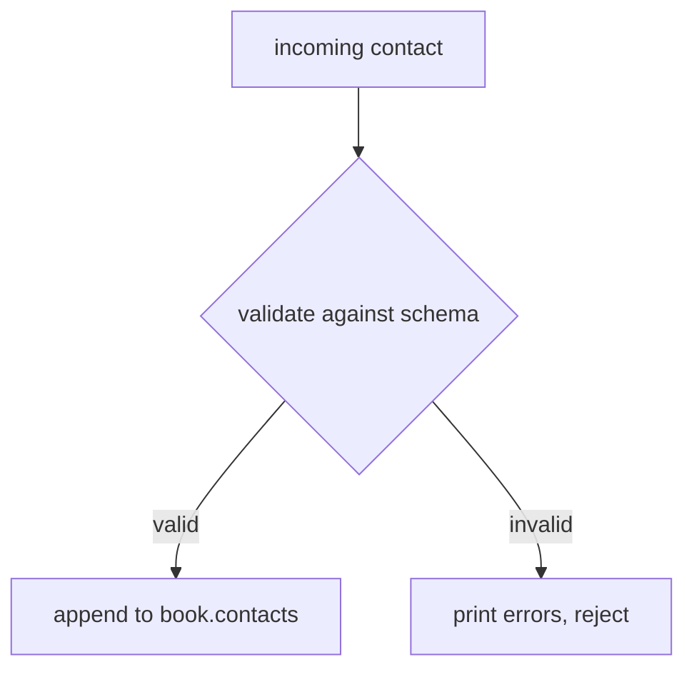

# Chapter 07 — Capstone: an address book

Time to combine everything: building values, parsing, reading, editing, and
schema validation — in one small program. Follow along with
[`examples/src/07_address_book.cpp`](../examples/src/07_address_book.cpp).

We'll build an in-memory **address book** that only accepts contacts matching a
schema, can ingest contacts from JSON payloads, edits stored records, and
serializes the whole thing.

## 1. Define what a valid contact looks like

```cpp
pjson::unique_ptr schema = pjson::parse(R"({
    "type": "object",
    "required": ["id", "name", "emails"],
    "properties": {
        "id":     { "type": "integer", "minimum": 1 },
        "name":   { "type": "string", "minLength": 1 },
        "emails": { "type": "array", "minItems": 1,
                    "items": { "type": "string", "pattern": "@" } },
        "tags":   { "type": "array", "items": { "type": "string" } }
    }
})");
if (!schema)
    return 1;
```

Every contact must have a positive `id`, a non-empty `name`, and at least one
email address containing `@`.

## 2. A gatekeeper that validates before storing

```cpp
bool addContact(pjson& book, const pjson& schema, const pjson& contact) {
    std::vector<pjson::SchemaError> errors;
    if (!contact.validate(schema, errors)) {
        for (const pjson::SchemaError& e : errors) {
            std::cout << "    " << (e.path.empty() ? "(root)" : e.path)
                      << ": " << e.message << "\n";
        }
        return false;                   // rejected
    }
    pjson& contacts = book["contacts"];
    if (contacts.size() > static_cast<size_t>(INT_MAX))
        return false;
    contacts[static_cast<int>(contacts.size())] = contact;
    return true;
}
```

The checked conversion is necessary because `size()` returns `size_t` while
the builder index is `int`. Assigning the index one past the end auto-extends
the array.



## 3. Start an empty book

```cpp
pjson book;
book["version"] = int64_t(1);
book["contacts"].resetTo(pjson::jsonArray); // start as an empty array
```

## 4. Add contacts three ways

**Built programmatically:**

```cpp
pjson ada;
ada["id"] = int64_t(1);
ada["name"] = "Ada Lovelace";
ada["emails"] += "ada@example.com";
ada["tags"] += "pioneer";
addContact(book, *schema, ada);
```

**From a JSON payload** (e.g. arriving over a network):

```cpp
auto incoming = pjson::parse(R"({
    "id": 2, "name": "Bob", "emails": ["bob@example.com", "b@work.com"]
})");
if (incoming)
    addContact(book, *schema, *incoming);
```

**An invalid one is rejected** with precise messages:

```cpp
auto invalid = pjson::parse(R"({ "id": 0, "name": "", "emails": [] })");
if (invalid)
    addContact(book, *schema, *invalid);
// /emails: array has 0 items, below minItems 1
// /id: value 0.0 is below minimum 1.0
// /name: string length 0 is below minLength 1
```

## 5. Edit and look up

```cpp
// Give Ada a second email.
book["contacts"][0]["emails"] += "ada@lovelace.org";

// Find the contact with id == 2 without creating anything.
const pjson* contacts = book.find("contacts");
for (size_t i = 0; contacts && i < contacts->size(); ++i) {
    const pjson* contact = contacts->find(static_cast<int>(i));
    int64_t id = 0;
    std::string name;
    if (contact && contact->tryGet("id", id) && id == int64_t(2) &&
        contact->tryGet("name", name))
        std::cout << name << "\n"; // Bob
}
```

## 6. Serialize the whole book

```cpp
pjson::SerializeOptions output = pjson::SerializeOptions::prettyPrinted();
output.maxOutputBytes = size_t(64) * 1024 * 1024;
std::cout << book.toString(output) << "\n";
```

produces a tidy, sorted-key document with both accepted contacts and their
edits.

## What this demonstrates

- **Creating** values programmatically and from parsed payloads.
- **Validating** untrusted input against a schema before trusting it.
- **Reading** with `find`/`tryGet` and **editing** with `+=` and indexing.
- **Serializing** the result — a full round of real-world usage.

You now know the whole library. The remaining chapters cover the surrounding
workflow.

Next: [Chapter 08 — Building & installing](08-building-and-installing.md).
