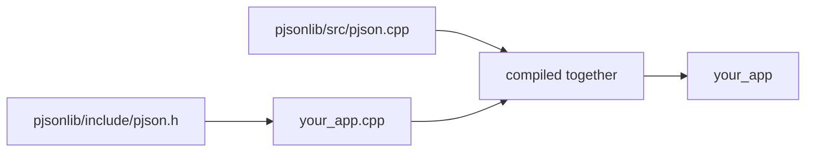

# Chapter 08 — Building & installing

There are several ways to use pjson in your project, from compiling its
canonical sources directly to consuming an installed package. Pick whichever
fits.

## Option 1 — Compile sources directly

pjson has **no public dependencies** beyond the C++ standard library. The
implementation is intentionally split by responsibility. A DOM-only build needs:

- `pjsonlib/include/pjson.h`
- `pjsonlib/src/pjson.cpp`

Parsing additionally needs `pjsonlib/include/pjson_parser.h` and
`pjsonlib/src/pjson_parser.cpp`; serialization needs `pjson_serialize.cpp`; JSON
Pointer and Patch need `pjson_pointer.cpp` and `pjson_patch.cpp`. Serialization
also requires the vendored Ryu source and its private include paths. Because
these details are easy to omit, the single `pjson::pjson` CMake target is the
recommended integration whenever more than the DOM-only core is used.

For a DOM-only program, compile `pjson.cpp` alongside your source and add the
public include directory:

```sh
c++ -std=c++11 -I path/to/pjson/pjsonlib/include \
    path/to/pjson/pjsonlib/src/pjson.cpp your_app.cpp -o your_app
```

In code:

```cpp
#include "pjson.h"
using namespace ByteDance;
```

Applications that parse, serialize, apply Pointer/Patch operations, or use
`pJsonSchemaValidator` should consume the CMake target, which already includes
all required translation units and private dependencies.



## Option 2 — The `build.sh` script

From the repository root, `build.sh` configures CMake, builds the library,
tests, examples, and benchmarks, and drops artifacts into `out/`:

```sh
./build.sh              # full Release + sanitized Debug verification sweep
./build.sh --test       # build, then run the test suite
./build.sh --fuzz       # bounded libFuzzer corpus replay (Clang required)
./build.sh --docs       # generate and validate the API reference
./build.sh --package    # static/shared relocatable install + pkg-config checks
./build.sh --license    # validate SPDX/REUSE licensing metadata
./build.sh --clean      # remove out/ first
./build.sh --bench --release-only # dependency-free performance benchmark
./build.sh --bench-compare --auto # compare pinned JSON libraries
```

Resulting layout:

```
out/
  include/pjson.h              DOM public header
  include/pjson_parser.h       parser public header
  include/pjson_schema.h       schema-validator public header
  release/lib/libpjson.a       Release static library
  release/bin/pjsontest        Release test runner
  release/bin/pjsonbench       Release benchmark runner
  debug/                       Debug artifacts
  build-release/ build-debug/  CMake build trees
```

The script also supports developer flags — `--asan` (sanitizers), `--format`
and `--check` (clang-format), `--tidy` (clang-tidy), `--bench`,
`--bench-compare`, `--fuzz`, `--docs`, `--package`, `--license`, and `--auto`
(install/download without prompting). With no flags, it runs the same full
sweep as `--all`, including Doxygen and SPDX/REUSE validation, static/shared
relocatable install and pkg-config checks, and bounded fuzzing when a usable
Clang/libFuzzer toolchain is available. It offers to fetch both pinned JSON and
JSON Schema conformance corpora; `--all --auto` accepts those downloads without
prompting. An explicit `--fuzz` request fails instead of skipping when that
toolchain is unavailable. See
[Chapter 09](09-testing.md) for fuzzing details and
[Chapter 10](10-contributing.md) for the contributor workflow.

## Option 3 — Use it from CMake

If your project uses CMake, add pjson as a subdirectory and link the exported
target:

```cmake
add_subdirectory(pjson)                    # the pjson repo
target_link_libraries(my_app PRIVATE pjson::pjson)
```

pjson attaches its include directory to the target, so `#include "pjson.h"`
just works. For an installed copy, first build and install the library:

```sh
cmake -S . -B build -DCMAKE_BUILD_TYPE=Release \
    -DPJSON_BUILD_TESTS=OFF \
    -DPJSON_BUILD_EXAMPLES=OFF \
    -DPJSON_BUILD_BENCHMARKS=OFF
cmake --build build --config Release
cmake --install build --config Release --prefix /path/to/pjson-prefix
```

The install contains `pjson.h`, `pjson_parser.h`, `pjson_schema.h`, the library, `pjsonConfig.cmake`,
`pjsonConfigVersion.cmake`, and `pjsonTargets.cmake`. The CMake package files
normally live under `<prefix>/<libdir>/cmake/pjson`; the exact `<libdir>` follows
the platform's GNU install-directory convention. Consume them with a versioned
config-package lookup:

```cmake
find_package(pjson 3.0 CONFIG REQUIRED)
target_link_libraries(my_app PRIVATE pjson::pjson)
```

Pass the installation prefix through `CMAKE_PREFIX_PATH` if it is not in a
standard search location. The package is relocatable, and its generated version
file accepts compatible releases from the same major version.

### pkg-config

Installation also writes a relocatable `pjson.pc` under
`<prefix>/<libdir>/pkgconfig`. After adding that directory to
`PKG_CONFIG_PATH`, compile with its published flags:

```sh
pkg-config --modversion pjson
c++ -std=c++11 your_app.cpp $(pkg-config --cflags --libs 'pjson >= 3.0') \
    -o your_app
```

## Package managers

The repository contains a Conan 2 recipe. From a checkout, create and test the
package with:

```sh
conan profile detect                 # needed once for a new Conan home
conan create . -s build_type=Release --build=missing
```

The recipe publishes the CMake target `pjson::pjson` and the pkg-config module
`pjson`. It supports Conan's `shared` and `fPIC` options.

An in-repository vcpkg overlay port is also available. It deliberately builds
the current checkout rather than downloading a possibly older archive:

```sh
"$VCPKG_ROOT/vcpkg" install pjson \
    --overlay-ports="$PWD/packaging/vcpkg/ports"
```

Configure consumers with the usual vcpkg toolchain file, then use the same
`find_package(pjson CONFIG REQUIRED)` and `pjson::pjson` target shown above.

## CMake options

| Option | Default | Effect |
|--------|---------|--------|
| `PJSON_BUILD_TESTS` | top-level `ON`; subproject `OFF` | Build and register the test runner |
| `PJSON_BUILD_EXAMPLES` | top-level `ON`; subproject `OFF` | Build the nine tutorial examples |
| `PJSON_BUILD_BENCHMARKS` | top-level `ON`; subproject `OFF` | Build the dependency-free benchmark |
| `BUILD_SHARED_LIBS` | `OFF` | Build a shared library instead of the default static library |
| `PJSON_SANITIZE` | `OFF` | Enable AddressSanitizer and UndefinedBehaviorSanitizer with GCC or Clang |
| `PJSON_BUILD_DOCS` | `OFF` | Build the Doxygen reference; requires Doxygen and Python 3 |
| `PJSON_BUILD_FUZZERS` | `OFF` | Build the seven coverage-guided fuzz targets |
| `PJSON_BENCH_COMPARE` | `OFF` | Add pinned nlohmann/json, RapidJSON, and simdjson comparisons to `pjsonbench` |
| `PJSON_BENCH_DEPS_DIR` | `.benchmark-deps` | Locate the pinned comparison sources |
| `PJSON_FUZZING_ENGINE` | empty | Supply an external fuzz-engine linker command instead of built-in libFuzzer |

These defaults describe a normal configure with no pre-seeded cache values.
Use the three explicit pjson component switches in scripts so the selected
target set does not depend on surrounding project configuration.

With an empty `PJSON_FUZZING_ENGINE`, `PJSON_BUILD_FUZZERS=ON` requires Clang
with libFuzzer on Linux/macOS. An external engine can instead be supplied
through `PJSON_FUZZING_ENGINE`. For a small
top-level build, set `PJSON_BUILD_TESTS`, `PJSON_BUILD_EXAMPLES`, and
`PJSON_BUILD_BENCHMARKS` to `OFF`; documentation and fuzz targets already
default to `OFF`. When pjson is added with `add_subdirectory()`, the three
developer components default to `OFF` automatically.

## Requirements

- A **C++11** (or newer) compiler.
- **CMake ≥ 3.21** if you use options 2 or 3. (Not needed for option 1.)
- Works on **Linux, macOS, and Windows** (MSVC, MinGW, clang, gcc).

## Platform notes

- **Linux / macOS:** any recent g++ or clang works out of the box.
- **Windows / MSVC:** open the folder in Visual Studio (which understands
  CMake), or configure from the command line:
  ```bat
  cmake -S . -B build
  cmake --build build --config Release
  ```

## What you learned

- The simplest full-featured integration is the `pjson::pjson` CMake target;
  direct source compilation is practical only when its complete feature-specific
  source list and private include paths are maintained by the embedding project.
- `build.sh` builds everything into `out/`; CMake integration exposes the
  `pjson::pjson` target.
- Installed CMake and pkg-config metadata are relocatable, and Conan 2 and an
  in-tree vcpkg overlay provide package-manager integration.
- pjson needs only C++11 and builds on Linux, macOS, and Windows.

Next: [Chapter 09 — Testing](09-testing.md).
