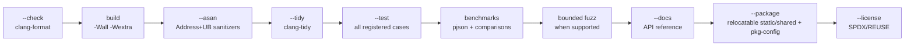

# Chapter 10 — Contributing

Thanks for wanting to improve pjson! This chapter covers the workflow, the
coding style, and the checks your change should pass.

## The project layout

```
pjson/
  pjsonlib/
    include/pjson.h          DOM public header
    include/pjson_parser.h   parser public header
    include/pjson_schema.h   schema-validator public header
    src/pjson.cpp            DOM/value/storage implementation
    src/pjson_parser.cpp     JSON parser implementation
    src/pjson_serialize.cpp  serializer implementation
    src/pjson_pointer.cpp    JSON Pointer implementation
    src/pjson_patch.cpp      JSON Patch/Merge Patch implementation
  pjsontest/src/        the test suite (tests_*.cpp + harness)
  examples/src/         runnable examples used by the docs
  docs/                 this tutorial series
  packaging/            package-manager metadata and overlays
  tests/                 install consumer smoke tests
  fuzz/                  standalone libFuzzer targets and seed corpora
  build.sh              build / format / lint / test driver
  clean.sh              remove build output, corpora, and benchmark dependencies
  .clang-format         formatting rules
  .clang-tidy           static-analysis rules
```

A design principle: **public headers stay declaration-focused**. The DOM must
not depend on `pJsonParser`; dependencies flow from parser to core. Keep new
internal helpers in the relevant private header/translation unit.

## The one command to run before submitting

```sh
./build.sh          # or, equivalently, ./build.sh --all
```

With no flags, `build.sh` runs the same full contributor sweep as `--all`:



- `--check` verifies formatting (run `./build.sh --format` to auto-fix).
- `--asan` builds with AddressSanitizer + UndefinedBehaviorSanitizer and fails
  on any finding.
- `--test` runs the full suite; it must be **green**.
- `--tidy` runs clang-tidy and fails on project findings.
- `--all` benchmarks pjson alongside pinned nlohmann/json, RapidJSON, and
  simdjson versions. Use `--bench` for the dependency-free pjson-only run, or
  `--bench-compare` to request comparison mode directly.
- `--all` also replays bounded corpora through seven libFuzzer targets covering
  DOM parsing, streaming, schema validation, and Patch/Merge Patch atomicity
  when the local platform has Clang and libFuzzer; otherwise that optional part is
  reported as skipped. `--fuzz` is strict and fails if it cannot run.
- `--all` builds the checked Doxygen reference and validates relocatable static
  and shared installs through CMake package and pkg-config consumers. Use
  `--docs` or `--package` to request those checks independently.
- `--license` checks every tracked file's SPDX/REUSE metadata. `--all` includes
  it; when needed, `--auto` installs the pinned checker under `out/`.

If `cmake`, `clang-format`, `clang-tidy`, Doxygen, or Python 3 are missing for a
selected check, `build.sh` offers to install them via your package manager; add
`--auto` to do so without prompting.
With `--auto`, the full sweep fetches both pinned JSON/JSON-Schema conformance
corpora and optional benchmark dependencies without prompting.

## Documentation and package checks

For public API or reference-documentation changes, build the checked Doxygen
reference (Doxygen and Python 3 are required):

```sh
cmake -S . -B out/build-docs \
  -DPJSON_BUILD_TESTS=OFF \
  -DPJSON_BUILD_EXAMPLES=OFF \
  -DPJSON_BUILD_BENCHMARKS=OFF \
  -DPJSON_BUILD_DOCS=ON
cmake --build out/build-docs --target pjson-docs-check
```

For CMake installation or package metadata changes, run:

```sh
./build.sh --package
```

The package check verifies relocated static and shared installs, their
config/version/target files, the `pjson::pjson` target, and mandatory pkg-config
consumers. Packaging changes should additionally run the
relevant Conan 2 `conan create .` or vcpkg overlay installation documented in
[Chapter 08](08-building-and-installing.md).

## Coding style

Style is enforced by `.clang-format`, so you rarely think about it — just run
`./build.sh --format`. The gist:

- 4-space indentation, members indented inside the `namespace`.
- Pointers bind to the type: `pjson* p`, `const std::string& s`.
- 100-column lines.
- Braces attach (`if (...) {`).

Naming conventions used in the codebase:

- Public methods are `camelCase` (`findPointer`, `parseStream`).
- Parameters are prefixed `a` (`aKey`, `aValue`); members with `_`
  (`_eType`, `_pValueMap`).
- Internal DOM helpers in `pjsonImpl` retain `_leadingUnderscore`; focused
  component-private helpers follow their translation unit's local convention.

## Adding a test

Every change should come with a test. Add a `TEST(...)` to the most relevant
`pjsontest/src/tests_*.cpp` (or create a new topic file and list it in
`pjsontest/CMakeLists.txt`). See [Chapter 09](09-testing.md) for the harness.
Cover the normal case **and** the edge cases.

## Adding an example

If you add a user-facing feature, consider a short example under
`examples/src/`, wired into `examples/CMakeLists.txt`, and reference it from the
docs so it stays exercised.

## Guidelines

- **No new dependencies.** pjson is intentionally standalone (standard library
  only).
- **Report data-domain failures softly.** Invalid JSON, lookup/type mismatch,
  validation failure, and patch failure use empty/status/error results. APIs that
  allocate or use exception-enabled streams may still propagate standard C++
  allocation or I/O exceptions unless declared `noexcept`.
- **Keep C++11 compatibility.**
- **Update the docs** when you change public behavior.
- **Update package and release metadata together** when changing the version or
  stable consumption contract.

## Submitting

1. Branch from `main`.
2. Make your change with tests.
3. Update user documentation and add a concise `CHANGELOG.md` entry for notable
   user-visible changes.
4. Run `./build.sh` (the full sweep) until clean. The focused commands above are
   also useful while iterating on documentation or packaging changes.
5. Open a pull request describing the change, why it is needed, and the exact
   commands used to verify it.

## What you learned

- The repo layout, and the rule that the header stays declaration-only.
- The single pre-submit command: `./build.sh` (equivalently `--all`).
- Style is auto-enforced; add normal and edge-case tests, keep the no-dependency
  and C++11 constraints, and preserve status-based data-error contracts.
- Documentation and packaging changes have focused checks in addition to the
  full code sweep.

---

You now know how to contribute changes and run the complete verification suite.
Next: [Chapter 11 — Streaming large JSON](11-streaming.md), followed by the
advanced [custom allocator guide](12-custom-allocators.md).
