# pjson Tutorials

Welcome! **pjson** ("Praveen's JSON") is an ultra-simple JSON library for C++.
This tutorial series takes you from *never having used JSON* all the way to
building a complete, schema-validated application — one small step at a time.

You do **not** need any prior JSON experience. We explain every concept as it
comes up.

## How to read this

Work through the chapters in order. Each one:

- introduces one idea,
- uses focused excerpts and, where provided, links an explicitly maintained
  program under [`examples/src/`](../examples/src),
- and ends with what you just learned.

```mermaid
flowchart LR
    A[00 What is JSON?] --> B[01 Getting started]
    B --> C[02 Creating JSON]
    C --> D[03 Parsing & reading]
    D --> E[04 Editing]
    E --> F[05 Parsing & errors]
    F --> G[06 Schema validation]
    G --> H[07 Capstone: address book]
    H --> I[08 Building & installing]
    I --> J[09 Testing]
    J --> K[10 Contributing]
    K --> L[11 Streaming large files]
    L --> M[12 Custom allocators]
```



## Chapters

| # | Chapter | You will learn |
|---|---------|----------------|
| 00 | [What is JSON?](00-what-is-json.md) | The data model, from zero |
| 01 | [Getting started](01-getting-started.md) | Include pjson and print your first value |
| 02 | [Creating JSON](02-creating-json.md) | Build objects, arrays, and nested data |
| 03 | [Parsing & reading](03-parsing-and-reading.md) | Turn text into data and read it back safely |
| 04 | [Editing](04-editing.md) | Change, add, and remove parts of a document |
| 05 | [Parsing, limits & errors](05-parsing-and-errors.md) | Control budgets, duplicates, and diagnostics |
| 06 | [Schema validation](06-schema-validation.md) | Check that data has the shape you expect |
| 07 | [Capstone: address book](07-capstone-address-book.md) | Put it all together |
| 08 | [Building & installing](08-building-and-installing.md) | Canonical sources, CMake, packages, `build.sh` |
| 09 | [Testing](09-testing.md) | Run and understand the test suite |
| 10 | [Contributing](10-contributing.md) | Style, sanitizers, and sending changes |
| 11 | [Streaming large JSON](11-streaming.md) | Process huge inputs and write incrementally |
| 12 | [Custom allocators](12-custom-allocators.md) | Control persistent DOM allocation and ownership |

## Reference and migration

- [Browsable API reference](https://pico-developer.github.io/pjson/) — generated
  per-symbol documentation (its [source page](reference/mainpage.md) is kept in
  this repository).
- [Migrating from nlohmann/json](migration-from-nlohmann-json.md) — translate
  DOM ownership, lookup, parsing, serialization, streaming, and validation.
- [Migrating from RapidJSON](migration-from-rapidjson.md) — replace
  allocator-bound DOM and Reader/Writer idioms with pjson equivalents.

Build and validate the browsable reference with Doxygen and Python 3:

```sh
cmake -S . -B out/build-docs \
  -DPJSON_BUILD_TESTS=OFF \
  -DPJSON_BUILD_EXAMPLES=OFF \
  -DPJSON_BUILD_BENCHMARKS=OFF \
  -DPJSON_BUILD_DOCS=ON
cmake --build out/build-docs --target pjson-docs-check
```

Then open `out/build-docs/docs/reference/html/index.html`. Documentation
warnings and missing public API families fail the build.

## Contributing and project policies

- [Contributor guide](../CONTRIBUTING.md) and
  [detailed workflow](10-contributing.md)
- [Security policy and private vulnerability reporting](../SECURITY.md)
- [Versioning and compatibility policy](../VERSIONING.md)
- [Release process](../RELEASING.md) and [changelog](../CHANGELOG.md)
- [Licensing and SPDX policy](../LICENSING.md)

## The one-minute taste

```cpp
#include "pjson.h"
#include <cstdint>
#include <iostream>
using namespace ByteDance;

int main() {
    pjson person;
    person["name"] = "Ada";
    person["age"]  = int64_t(36);
    person["languages"] += "C++";
    person["languages"] += "Ada";

    pjson::SerializeOptions pretty = pjson::SerializeOptions::prettyPrinted();
    std::cout << person.toString(pretty) << "\n";

    pjson::unique_ptr parsed = pjson::parse(person.toString(pretty));
    std::string name;
    if (parsed && parsed->tryGet("name", name))
        std::cout << name << "\n"; // Ada
}
```

Ready? Start with [Chapter 00 — What is JSON?](00-what-is-json.md), or jump to
the canonical runnable [Hello, World tutorial](01-getting-started.md).
